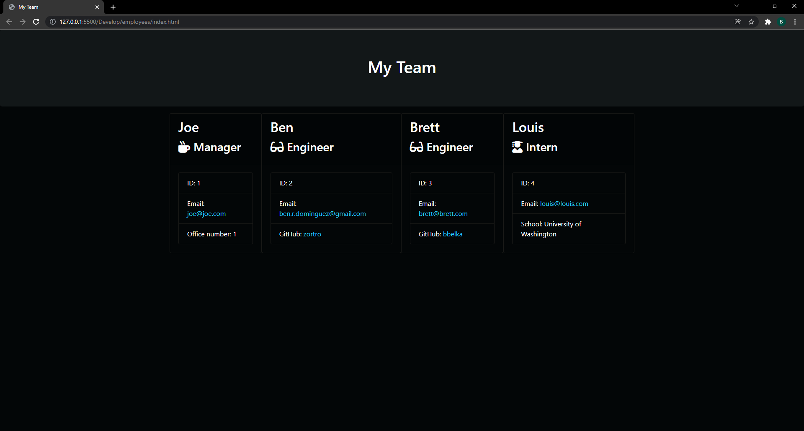

<!-- proj name -->

# Team-Profile-Generator

<!-- demo video -->

[Video Demo](./assets/demo.mp4)

<!-- toc -->

## Table of Contents

- [Team-Profile-Generator](#title)
- [About Team-Profile-Generator](#about-proj)
- [Getting Started](#getting-started)
- [Usage](#Usage)
- [Testing](#testing)
- [Contributing](#contributing)
- [Contact Me](#contact-me)

<!-- about project -->

## About Team-Profile-Generator

Team Profile Generator is a business tool, used for keeping track of employees and their roles. Team Profile Generator is able to generate a card for each of your employees. All employees will have an ID and email. Managers will have an office number, Engineers will have a link to their GitHub profile, and Interns will have their school of study listed.

<!-- Getting Started -->

## Getting Started
This is how you can get started using Team-Profile-Generator locally. Begin by following these instructions.
### Installation

Download or clone the git repository to your local machine.

<!-- Usage -->

## Usage

In the root folder, open a new terminal window, be sure to have NPM and NodeJS installed, and run 'npm i' to install the required dependencies to your copy of the project. After the install has, in the same terminal window run the command 'node index.js' to begin generating your team profile. You will be prompted a series of questions which you must answer in order to complete the profile. When completed your profile will populate in './employees/index.html'.

<!-- Testing -->

## Testing

To test Team Profile Generator follow the install guide under the [about](#about-proj) section. Then in './test' run in a terminal window the command 'npm test' to test whether the modules located in './lib' are functioning properly. If the modules in './lib' are functioning then you may continue to the [usage](#Usage) section of this readme. If any of these modules fail please open a pull request or contact me through my email located in the [contact me](#contact-me) section of this readme.

<!-- Contributing -->

## Contributing

To contribute to this project please reach out to me using my email or create a new issue.

<!-- Contact Me -->

## Contact Me
- [zortro](http://github.com/zortro)
- ben.r.dominguez@gmail.com

This readme file was generated using [ReadMe Generator](https://github.com/zortro/readme-generator/)